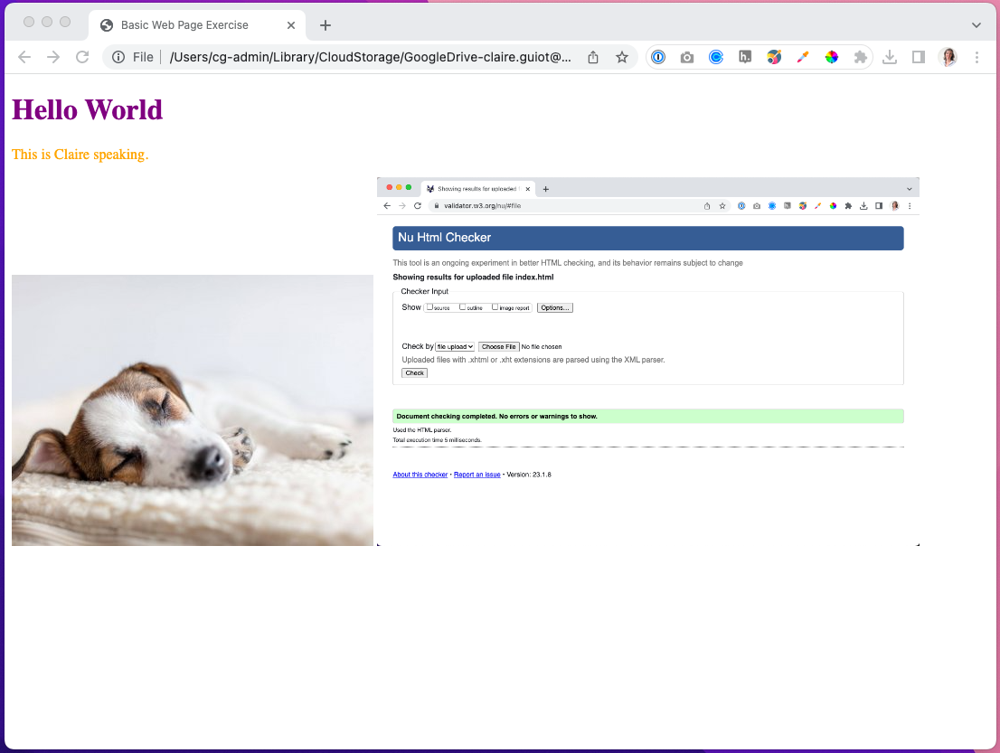

# Exercise 1 - Basic web page
This is your remote repository readme file. You are seeing this file because you have successfully accepted the assignment link and GitHub automatically created a remote repository for you.
## Objectives
Create a basic folder structure for a website. Use HTML skeleton code to create a simple web page that includes a little content and a couple images. Apply an external CSS style to the content. Learn to troubleshoot code.
## Instructions

### Step 1: Get set up
Detailed instructions for the tasks below are included in the References Guides and in the How to Complete your Exercises video.
1. Install GitHub Desktop.
2. Install Visual Studio Code on your computer, and customize it by installing the recommended VS Code extensions, turn on word wrap, and disable auto-closing HTML tags.
3. Clone the remote repository to your local machine.

You are now completely set up and can complete the instructions in step 2 but you need to have done the week 1 reading to understand the exercise.

### Step 2: Create a website
At the minimum, a website is a repository that includes a file called index.html (the website’s homepage), a file called style.css (where all the CSS is located), and a folder to store the images.
Your repository also includes the assignment readme file. You don’t have to delete the readme file, it does no harm and wouldn’t be visible when visitors view the website through a browser, but know that the readme file wouldn’t be present in a real website’s folder.
By the end of this exercise, your webpage should similar to the image below.

1. Read “Add files to your website folder” in the VS Code Reference Guide. In your local exercise repository, create a new file called index.html, a file called style.css and a folder called images. 
2. Read “Add skeleton code” in the “VS Code Reference Guide”. In VS Code, open index.html and add the HTML skeleton code. Add an HTML comment in the head section of the html code including: the term, course code, section number, student name, and the name of the exercise. Example:
`<!-- W23 DGL 103 CVS1 - Claire Guiot - Basic Web Page Exercise -->`
3. Reference the stylesheet by adding `<link rel="stylesheet" href="style.css">` in the head section of index.html
4. Change the page title to 'Basic Web Page Exercise'.
5. Add the following code where you believe it belongs:
`<h1>Hello World</h1> 
This is *your name* speaking.
`. Make sure you save the document. Note: In VS Code, if the file name in the tab at the top of the window has a white circle next to it then the file includes edits that have not been saved yet.
6. Check out what your web page looks like by opening index.html in a web browser: Right-click anywhere in the file > Open in Default Browser (if you don't see this option then you haven't installed the Open in Browser VS Code extension yet - see step 1 above). I recommend making Google Chrome your default browser (https://support.google.com/chrome/answer/95417?hl=en&co=GENIE.Platform%3DDesktop).
7. Back in VS Code, change the colour of the HTML p element by adding `p {color: orange;}` to the style.css file. Go back to your browser and refresh the page to see the edit. If you can't see the change in colour in your browser then there is an issue with the way you linked the CSS file to the HTML file.
8. Change the colour of the HTML H1 element to anything you like.
9. Now we’re going to include an image in your webpage. Add an image file to the images folder in your local repository. It can be any image you like but most popular browsers support: BMP, SVG, JPEG, JPG, PNG and GIF image file extensions. Name the image with a filename that makes sense, for ex: smalldog.jpg
10. In index.html, add the image below the paragraph element. For ex: ``. Change the image file name in the src attribute and the image description in the alt attribute to match the file that you added to the images folder. Note that the `` element is self-closing, it doesn’t need an end tag. Save and go back to your browser and refresh the page to see the edit. If you can’t see the image then the link might be broken, make sure that you’ve used the correct filename and relative file path.
11. Commit your changes to your local repository - See the GitHub and GitHub Desktop Reference Guide.

### Step 3: Learn to trouleshoot errors
1. Using the HTMLHint extension
If you have installed the HTMLHint VS Code extension then any errors in the HTML will be automatically underlined with a squiggly line. If the extension has detected errors, a number will appear next to a warning icon in the status bar at the bottom of the VS code window - See VS Code Reference Guide. 
    * Click on the warning icon in the status bar to open the Problems Panel. 
    * Type this error in your HTML file: `<image`. The following error message should appear in the Problems Panel "Special characters must be escaped : [ < ]". This error tells you that the HTML element is missing a closing angled bracket. Click on the error message to navigate to the error in the HTML. 
    * Type a closing angled bracket at the end of the HTML element. Notice that the error message has changed, it is now telling you that the `<image>` element is missing an end tag, yet image elements are self-closing. The syntax is wrong, the HTML for an image is ``, not`<image>`, but the extension isn't smart enough to know that you wanted an image. While the HTMLHint extension can save you a lot of time by pointing out errors, it won't solve all your problems. It will take you some practice to be able to understand the error messages. 
2. Another way to validate your HTML is by using the official W3C Markup Validator. 
    * Go to https://validator.w3.org/#validate_by_upload. Choose your index.html file in your local repository and click the Check button. If there are no errors then you should see a green message that says “Document checking completed. No errors or warnings to show.” If you get an error message then troubleshoot your work until you get the green message
    * Take a screenshot of your HTML validation results and save it in the images folder in your local repository.
    * In index.html, add the screenshot image below the image from step 2. For ex: ``. Change the image file name in the src attribute and the image description in the alt attribute to match the file that you added to the images folder.
4. Just for fun, click and drag on the edge of your browser window to resize it and see what happens to the placement of the images when the browser window is too small for them to fit side-by-side.
3. Commit your changes to your local repository - See the GitHub and GitHub Desktop Reference Guide.

### Step 4: Submit your work
Complete the following steps from the GitHub and GitHub Desktop Reference Guide:
1. Commit your changes if you’ve made changes since the last commit.
2. Push your changes to GitHub. Check out your remote repository in GitHub to make sure that the files look the same as your the files in your local repository.
3. Submit your assignment in Brightspace:
You can access the assignment submission tool by navigating to the week’s assignment in the Content Area, or by clicking on Assignments in the main menu. Click on the "Unit 1 Exercises" assignment and copy and follow the provided instructions. 
4. If you have been using a lab computer on campus to do your work with GitHub Desktop, remember to shutdown or restart the computer before you leave the room, so that other students won’t have access to your repositories.

## Deadlines
Assignments must be submitted before the end of the week (before the next week’s class) but they will only be graded at the end of every unit. Late assignments will not be accepted and will receive an F. You can complete and submit a contract that allows you to extend the deadline for an assignment but you must email it to your instructor a minimum of 48 hrs before the deadline. Students are only entitled to 2 extensions per course. Deadline extensions are only allowed for those unplanned, unexpected emergencies that life sometimes throws at us, and they will only be approved by your instructor if you follow the correct process. See the Course Info folder in Brightspace for more info.
